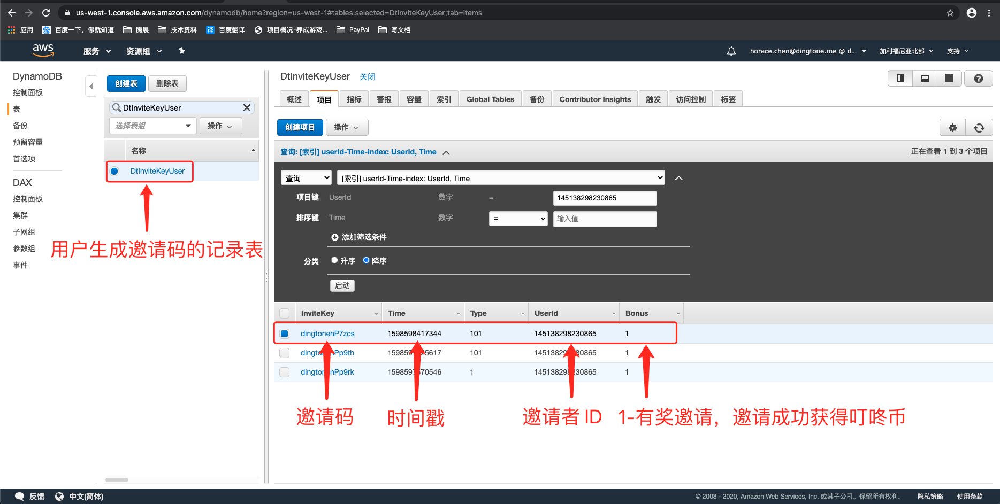
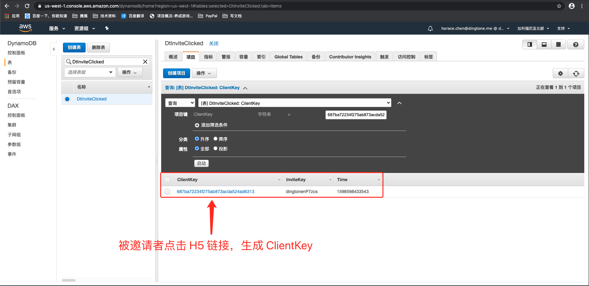
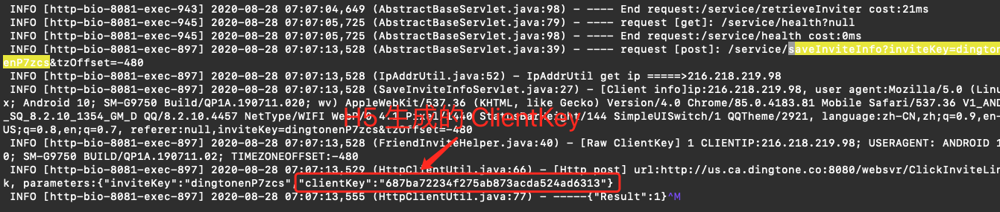
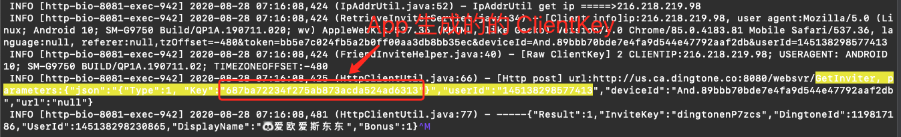
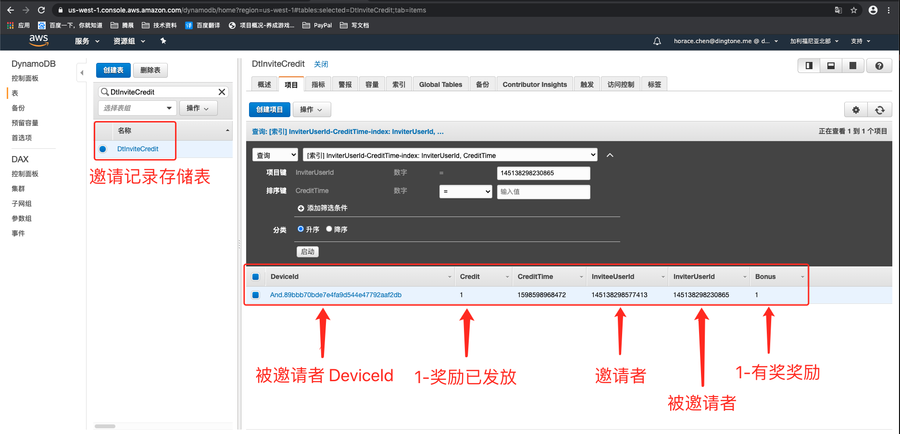

# 邀请流程分析

## 概要信息

> 邀请者：145138298230865
>
> 被邀请者：145138298577413
>
> 邀请者生成邀请记录表：DtInviteKeyUser
>
> 被邀请者点击邀请链接记录表：DtInviteClicked
>
> 邀请成功表：DtInviteCredit
>
> > homePage(dingdone)：
> >
> > ```
> > # 连接服务器
> > ssh ec2-user@184.169.145.96 -i /Users/tz/Horace/Code/Server/sshKey/Dingtone_WebSite_PN1_AWS_20161104.pem -o IdentitiesOnly=yes -o StrictHostKeyChecking=no
> > # 进入日志目录
> > cd /mnt/sdf/dingtone/log
> > ```
>
> > homePage(talku)：
> >
> > ```
> > # 连接服务器
> > ssh ec2-user@204.236.130.125 -i /Users/tz/Horace/Code/Server/sshKey/OverAll_WebSite_PN1_AWS_20161104.pem -o IdentitiesOnly=yes -o StrictHostKeyChecking=no
> > # 进入docker
> > ld talkyouwebsite
> > # 进入日志目录
> > cd /mnt/sdf/dingtone/log
> > ```

## 一.  分享邀请链接

>用户分享邀请链接，将在 DynamoDB.DtInviteKeyUser 表生成一条记录
>
>


---


## 二. 点击邀请链接

> 被邀请者点击分享链接，将在 DynamoDB.DtInviteClicked 生成邀请链接点击记录
>
> 


> 通过 `inviteKey(邀请码)` 从 homepage 日志中查找 <font color=red>H5 生成的ClientKey </font>，vim 打开日志文件，查找：
>
> ```
> # dingtonenP7zcs 需要修改为当前实际邀请码
> saveInviteInfo\&.*dingtonenP7zcs
> ```
>
> 


---


## 三. 被邀请者注册完成

> vim 打开 homepage 日志文件，查找 <font color=red>APP 生成的 ClientKey</font>：
>
> ```
> # 145138298577413 需要修改成被邀请者的 userId
> GetInviter\&.*145138298577413
> ```
>
> 
>
> ==PS：type-1 表示key中的是 ClientKey   type-2  表示key中的是 inviteKey==

## 四. 校对 ClientKey 并发邀请奖励

> 如果 H5 生成的 Clientkey 和 APP 生成的 ClientKey 一致，则会存储邀请匹配记录，并发放奖励，<font color=red>大部分错误就是两个生成的Clientkey不一致导致邀请者收不到邀请奖励</font>
>
> 