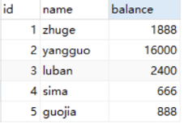
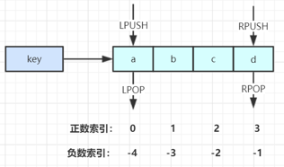
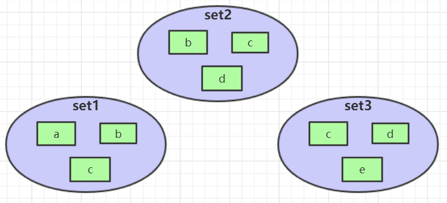
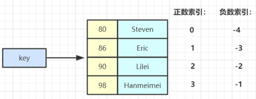

# 数据结构

## string

### 常用命令

1. 字符串常用操作

   ```
   SET key value 			            // 存入字符串键值对
   MSET key value [key value ...] 	// 批量存储字符串键值对
   SETNX key value 		            // 存入一个不存在的字符串键值对
   GET key 			                  // 获取一个字符串键值
   MGET key [key ...]	 	          // 批量获取字符串键值
   DEL key [key ...] 		          // 删除一个键
   EXPIRE key seconds 		          // 设置一个键的过期时间(秒)
   ```

   

2. 原子加减

   ```
   INCR key 			          // 将 key 中储存的数字值加1
   DECR key 			          // 将 key 中储存的数字值减1
   INCRBY key increment 		// 将key所储存的值加上 increment
   DECRBY key decrement 	  // 将key所储存的值减去 decrement
   ```


### 应用场景

1. 单值缓存

   ```
   SET key value 	
   GET key 
   ```

2. 对象索引

   ```
   1) SET user:1 value(json格式数据)
   2) MSET user:1:name zhuge user:1:balance 1888
      MGET user:1:name user:1:balance
   ```

    

3. 防止重复请求

   

4. 分布式锁

   ```text
   SETNX product:10001 true 		    // 返回1代表获取锁成功
   SETNX product:10001 true 		    // 返回0代表获取锁失败
   。。。执行业务操作
   DEL product:10001			          // 执行完业务释放锁
   
   SET product:10001 true ex 10 nx	// 防止程序意外终止导致死锁
   ```

5. 计数器

   ```text
   INCR article:readcount:{文章id}  	
   GET article:readcount:{文章id} 
   ```

    

6. Web集群session共享

   ```text
   spring session + redis实现 session 共享
   ```

7. 分布式系统全局序列号

   ```text
   INCRBY orderId 1000		// redis批量生成序列号提升性能
   ```


---


## hash

### 常用命令

```text
HSET key field value 			                // 存储一个哈希表 key 的键值
HSETNX key field value 		                // 存储一个不存在的哈希表 key 的键值
HMSET key field value [field value ...] 	// 在一个哈希表 key 中存储多个键值对
HGET key field 				                    // 获取哈希表 key 对应的 field 键值
HMGET key field [field ...] 		          // 批量获取哈希表 key 中多个 field 键值
HDEL key field [field ...] 		            // 删除哈希表 key 中的 field 键值
HLEN key				                          // 返回哈希表 key 中 field 的数量
HGETALL key				                        // 返回哈希表 key 中所有的键值

HINCRBY key field increment 		          // 为哈希表 key 中 field 键的值加上增量 increment
```


### 应用场景

1. 对象缓存

   ```
   HMSET user {userId}:name zhuge {userId}:balance 1888
   HMSET user 1:name zhuge 1:balance 1888
   HMGET user 1:name 1:balance  
   ```

    

2. 电商购物车

   > 以用户 id 为 key
   > 商品 id 为 field
   > 商品数量为 value

   ```
   添加商品 -> hset cart:1001 10088 1
   增加数量 -> hincrby cart:1001 10088 1
   商品总数 -> hlen cart:1001
   删除商品 -> hdel cart:1001 10088
   获取购物车所有商品 -> hgetall cart:1001
   ```

    


### hash 结构优缺点

> **优点**
>
> - 同类数据归类整合储存，方便数据管理
> - 相比 string 操作消耗内存与 cpu 更小
> - 相比 string 储存更节省空间
>


> **缺点**
>
> - 过期功能不能使用在 field 上，只能用在 key 上
> - Redis 集群架构下不适合大规模使用


---


## list

### 常用命令

```
LPUSH key value [value ...] 		// 将一个或多个值value插入到key列表的表头(最左边)
RPUSH key value [value ...]	 	  // 将一个或多个值value插入到key列表的表尾(最右边)
LPOP key			                  // 移除并返回key列表的头元素
RPOP key			                  // 移除并返回key列表的尾元素
LRANGE key start stop		        // 返回列表key中指定区间内的元素，区间以偏移量start和stop指定

BLPOP key [key ...] timeout	    // 从key列表表头弹出一个元素，若列表中没有元素，阻塞等待 timeout 秒,如果timeout= 0,一直阻塞等待
BRPOP key [key ...] timeout 	  // 从key列表表尾弹出一个元素，若列表中没有元素，阻塞等待	timeout 秒,如果timeout=0,一直阻塞等待
```

### 应用场景

1. 常用数据结构

   ```text
   Stack(栈) = LPUSH + LPOP -> FILO
   Queue(队列）= LPUSH + RPOP
   Blocking MQ(阻塞队列）= LPUSH + BRPOP
   ```

    

2. 微博和微信公众号消息流

   > 诸葛老师关注了 MacTalk，备胎说车等大V

   ```
   1）MacTalk发微博，消息ID为10018
   LPUSH msg:{诸葛老师-ID} 10018
   2）备胎说车发微博，消息ID为10086
   LPUSH msg:{诸葛老师-ID} 10086
   3）查看最新微博消息
   LRANGE msg:{诸葛老师-ID} 0 5
   ```

    


---


## set

### 常用命令

1. set常用操作

   ```
   SADD key member [member ...]	// 往集合 key 中存入元素，元素存在则忽略，若 key 不存在则新建
   SREM key member [member ...]	// 从集合 key 中删除元素
   SMEMBERS key					        // 获取集合 key 中所有元素
   SCARD key					            // 获取集合 key 的元素个数
   SISMEMBER key member			    // 判断 member 元素是否存在于集合key中
   SRANDMEMBER key [count]			  // 从集合 key 中选出 count 个元素，元素不从 key 中删除
   SPOP key [count]				      // 从集合 key 中选出 count 个元素，元素从 key 中删除
   ```

2. set 运算操作

   ```
   SINTER key [key ...] 				            // 交集运算
   SINTERSTORE destination key [key ..]		// 将交集结果存入新集合 destination 中
   SUNION key [key ..] 				            // 并集运算
   SUNIONSTORE  destination key [key ...]	// 将并集结果存入新集合 destination 中
   SDIFF key [key ...] 				            // 差集运算
   SDIFFSTORE destination key [key ...]		// 将差集结果存入新集合 destination 中
   ```


### 应用场景

1. 微信抽奖小程序

   ```
   1）点击参与抽奖加入集合
   SADD key {userlD}
   2）查看参与抽奖所有用户
   SMEMBERS key	  
   3）抽取count名中奖者
   SRANDMEMBER key [count] / SPOP key [count]
   ```

    

2. 微信微博点赞，收藏，标签

   ```
   1) 点赞
   SADD like:{消息ID} {用户ID}
   2) 取消点赞
   SREM like:{消息ID} {用户ID}
   3) 检查用户是否点过赞
   SISMEMBER like:{消息ID} {用户ID}
   4) 获取点赞的用户列表
   SMEMBERS like:{消息ID}
   5) 获取点赞用户数 
   SCARD like:{消息ID}
   ```

    

3. 集合操作

   ```
   SINTER set1 set2 set3 -> { c }
   SUNION set1 set2 set3 -> { a,b,c,d,e }
   SDIFF set1 set2 set3 -> { a }
   ```

   

4. 集合操作实现微博微信关注模型

   ```text
   1) 诸葛老师关注的人: 
   zhugeSet --> {yangguo, sima, luban}
   2) 杨过老师关注的人:
   yangguoSet --> {zhuge, sima, luban, guojia}
   3) 司马老师关注的人: 
   simaSet-> {zhuge, yangguo, guojia, luban, xunyu}
   4) 我和杨过老师共同关注: 
   SINTER zhugeSet yangguoSet --> {sima, luban}
   5) 我关注的人也关注他(杨过老师): 
   SISMEMBER simaSet yangguo 
   SISMEMBER lubanSet yangguo
   6) 我可能认识的人: 
   SDIFF yangguoSet zhugeSet --> (zhuge, guojia}
   ```

    

7. 集合操作实现电商商品筛选

   
   ```
   ADD brand:huawei P30
   SADD brand:xiaomi mi-6X
   SADD brand:iPhone iphone8
   SADD os:android  P30 mi-6X
   SADD cpu:brand:intel P30 mi-6X
   SADD ram:8G P30 mi-6X iphone8
      
   SINTER os:android cpu:brand:intel ram:8G --> {P30，mi-6X}
   ```


---


## zset有序集合

 

### 常用命令

1. zset 常用操作

   ```
   ZADD key score member [[score member]…]	// 往有序集合 key 中加入带分值元素
   ZREM key member [member …]		          // 从有序集合 key 中删除元素
   ZSCORE key member 			                // 返回有序集合 key 中元素 member 的分值
   ZINCRBY key increment member		        // 为有序集合key中元素 member 的分值加上 increment 
   ZCARD key				                        // 返回有序集合 key 中元素个数
   ZRANGE key start stop [WITHSCORES]	    // 正序获取有序集合 key 从 start 下标到 stop 下标的元素
   ZREVRANGE key start stop [WITHSCORES]	  // 倒序获取有序集合 key 从 start 下标到 stop 下标的元素
   ```

      

2. zset 集合操作

   ```
   ZUNIONSTORE destkey numkeys key [key ...] 	// 并集计算
   ZINTERSTORE destkey numkeys key [key …]	    // 交集计算
   ```
   

   
### 应用场景

1. zset集合操作实现排行榜

   ```
   1）点击新闻
   ZINCRBY hotNews:20190819 1 守护香港
   2）展示当日排行前十
   ZREVRANGE hotNews:20190819 0 10 WITHSCORES 
   3）七日搜索榜单计算
   ZUNIONSTORE hotNews:20190813-20190819 7 
   hotNews:20190813 hotNews:20190814... hotNews:20190819
   4）展示七日排行前十
   ZREVRANGE hotNews:20190813-20190819 0 10 WITHSCORES
   ```

    

   

---


# 部署方式

## 单机部署

### Redis安装

> [下载地址1](http://redis.io/download)   [下载地址2](http://download.redis.io/releases)
>
> 1. 安装 gcc
>
>    ```
>    yum install gcc
>    ```
>
> 2. 把下载好的 redis‐5.0.3.tar.gz 放在 /usr/local 文件夹下，并解压
>
>    ```
>    wget http://download.redis.io/releases/redis‐5.0.7.tar.gz
>    wget http://download.redis.io/releases/redis-5.0.7.tar.gz
>    tar xzf redis‐5.0.7.tar.gz
>    cd redis‐5.0.7
>    ```
>
> 3. 进入到解压好的 redis‐5.0.3 目录下，进行编译与安装 
>
>    ```
>    make
>    ```
>
> 4. 启动并指定配置文件
>
>    ```
>    src/redis‐serverredis.conf(注意要使用后台启动，所以修改 redis.conf 里的 daemonize 改为 yes)
>    ```
>
> 5. 验证启动是否成功
>
>    ```
>    ps ‐ef | grep redis
>    ```
>
> 6. 进入 redis 客户端
>
>    ```
>    src/redis‐cli
>    ```
>
> 7. 退出客户端
>
>    ```
>    quit
>    ```
>
> 8. 退出redis服务
>
>    ```
>    (1) pkill redis‐server
>    (2) kill 进程号
>    (3) src/redis‐cli shutdown
>    ```
>
> **安装成功后目录如下**
>
>  


---


## 主从架构

 


### 环境搭建

> 1. 复制一份 redis.conf 文件
>
> 2. 将相关配置修改为如下值:
>
>    ```text
>    port 6380
>    pidfile /var/run/redis_6380.pid
>    logfile "6380.log"
>    dir /usr/local/redis‐5.0.7/data/6380
>    ```
>
> 3. 配置主从复制
>
>    ```text
>    replicaof 192.168.0.60 6379  #从本机 6379 的 redis 实例复制数据
>    replica‐read‐only yes
>    ```
>
> 4. 启动从节点
>
>    ```
>    redis‐server redis.conf
>    ```
>
> 5. 连接从节点
>
>    ```
>    redis‐cli ‐p 6380
>    ```
>
> 6. 测试在6379实例上写数据，6380实例是否能及时同步新修改数据
>
> 7. 可以自己再配置一个6381的从节点


### 工作原理

> 如果你为master配置了一个 slave，不管这个slave是否是第一次连接上 Master，它都会发送一个 SYNC 命 令(redis2.8 版本之前的命令)给 master 请求复制数据。
>
>  master 收到 SYNC 命令后，会在后台进行数据持久化通过 bgsave 生成最新的 rdb 快照文件，持久化期间， master 会继续接收客户端的请求，它会把这些可能修改数据集的请求缓存在内存中。当持久化进行完毕以 后，master 会把这份 rdb 文件数据集发送给 slave，slave 会把接收到的数据进行持久化生成 rdb，然后再加 载到内存中。然后，master 再将之前缓存在内存中的命令发送给 slave。
>
>  当 master 与 slave 之间的连接由于某些原因而断开时，slave 能够自动重连 master，如果 master 收到了多 个 slave 并发连接请求，它只会进行一次持久化，而不是一个连接一次，然后再把这一份持久化的数据发送 给多个并发连接的slave。 
>
> 当 master 和 slave 断开重连后，一般都会对整份数据进行复制。但从 redis2.8 版本开始，master 和 slave 断开重连后支持部分复制。


### 主从数据复制

> 从2.8版本开始，slave 与 master 能够在网络连接**断开重连后只进行部分数据复制。** 
>
> master 会在其内存中创建一个复制数据用的缓存队列，缓存最近一段时间的数据，master 和它所有的 slave 都维护了复制的数据下标 offset 和 master 的进程id，因此，当网络连接断开后，slave 会请求 master 继续进行未完成的复制，从所记录的数据下标开始。如果 master 进程id变化了，或者从节点数据下标 offset 太旧，已经不在 master 的缓存队列里了，那么将会进行一次全量数据的复制。 
>
> **从2.8版本开始，redis 改用可以支持部分数据复制的命令 PSYNC 去 master 同步数据**


---


> **主从复制(全量复制)流程图:**
>
> 


---


>**主从复制(部分复制)流程图:**
> 
>


### Jedis连接

1. 引入相关依赖

   ```
   <dependency>
   	<groupId>redis.clients</groupId>
   	<artifactId>jedis</artifactId>
   	<version>2.9.0</version>
   </dependency>
   ```

   

2. 访问代码：

   ```java
   import redis.clients.jedis.Jedis;
   import redis.clients.jedis.JedisPool;
   import redis.clients.jedis.JedisPoolConfig;
   import redis.clients.jedis.Pipeline;
   
   import java.io.IOException;
   import java.util.Arrays;
   import java.util.List;
   
   public class JedisSingleTes {
       public static void main(String[] args) throws IOException {
   
           JedisPoolConfig jedisPoolConfig = new JedisPoolConfig();
           jedisPoolConfig.setMaxTotal(20);
           jedisPoolConfig.setMaxIdle(10);
           jedisPoolConfig.setMinIdle(5);
   
           // timeout，这里既是连接超时又是读写超时，从 Jedis 2.8开始有区分 connectionTimeout 和 soTimeout 的构造函数
           JedisPool jedisPool = new JedisPool(jedisPoolConfig, "192.168.0.60", 6379, 3000, null);
   
           Jedis jedis = null;
           try {
               //从redis连接池里拿出一个连接执行命令
               jedis = jedisPool.getResource();
   
               System.out.println(jedis.set("single", "zhuge"));
               System.out.println(jedis.get("single"));
   
               //管道示例
   
               //管道的命令执行方式:cat redis.txt | redis‐cli ‐h 127.0.0.1 ‐a password ‐p 6379 ‐‐pipe
               Pipeline pl = jedis.pipelined();
               for (int i = 0; i < 10; i++) {
                   pl.incr("pipelineKey");
                   pl.set("zhuge" + i, "zhuge");
               }
               List<Object> results = pl.syncAndReturnAll();
               System.out.println(results);
   
               //lua脚本模拟一个商品减库存的原子操作
               //lua脚本命令执行方式:redis‐cli ‐‐eval /tmp/test.lua , 10
               jedis.set("product_count_10016", "15"); //初始化商品10016的库存
               String script = " local count = redis.call('get', KEYS[1]) " +
                       " local a = tonumber(count) " +
                       " local b = tonumber(ARGV[1]) " +
                       " if a>= b then " +
                       " redis.call('set', KEYS[1], count‐b) " +
                       " return 1" +
                       " end " +
                       " return 0 ";
               Object obj = jedis.eval(script, Arrays.asList("product_count_10016"), Arrays.asList("10"));
               System.out.println(obj);
           } catch (Exception e) {
               e.printStackTrace();
           } finally {
               //注意这里不是关闭连接，在JedisPool模式下，Jedis会被归还给资源池。
               if (jedis != null)
                   jedis.close();
           }
       }
   }
   ```


## 哨兵架构


> sentinel 哨兵是特殊的 redis 服务，不提供读写服务，主要用来监控 redis 实例节点。 哨兵架构下 client 端第一次从哨兵找出 redis 的主节点，后续就直接访问 redis 的主节点，不会每次都通过 sentinel 代理访问 redis 的主节点，当 redis 的主节点发生变化，哨兵会第一时间感知到，并且将新的 redis 主节点通知给 client 端(这里面 redis 的 client 端一般都实现了订阅功能，订阅 sentinel 发布的节点变动消息)
>
> 在 redis3.0 以前的版本要实现集群一般是借助哨兵 sentinel 工具来监控 master 节点的状态，如果 master 节点异常，则会做主从切换，将某一台 slave 作为 master，哨兵的配置略微复杂，并且性能和高可用性等各方面表现一般，特别是在主从切换的瞬间存在访问瞬断的情况，而且哨兵模式只有一个主节点对外提供服务，没法支持很高的并发，且单个主节点内存也不宜设置得过大，否则会导致持久化文件过大，影响数据恢复或主从同步的效率


### 环境搭建

1. 复制一份sentinel.conf文件

   ```
   cp sentinel.conf sentinel‐26379.conf
   ```

2. 将相关配置修改为如下值:

   ```
   port 26379
   daemonize yes
   pidfile "/var/run/redis‐sentinel‐26379.pid"
   logfile "26379.log"
   dir "/usr/local/redis‐5.0.7/data"
   # sentinel monitor <master‐name> <ip> <redis‐port> <quorum>
   # master-name 是服务器的名称，可以自定义
   # quorum 是一个数字，指明当有多少个 sentinel 认为一个 master 失效时(值一般为:sentinel总数/2 + 1)，master才算真正失效
   sentinel monitor mymaster 192.168.0.60 6379 2
   ```

3. 启动sentinel哨兵实例

   ```
   src/redis‐sentinel sentinel‐26379.conf
   ```

4. 查看 sentinel 的 info 信息

   ```
   src/redis‐cli ‐p 26379
   127.0.0.1:26379>info
   可以看到 Sentinel 的 info 里已经识别出了 redis 的主从
   ```

    

   

5. 可以自己再配置两个sentinel，端口26380和26381，注意上述配置文件里的对应数字都要修改

    

### 模拟线上故障

1. 已知 6379 为 master

   ```
   src/redis‐cli ‐p 26379
   127.0.0.1:26379>info
   ```

    

2. kill master 节点

    

3. 查看 Jedis 程序 set 方法（报错 timeout，直到重新选举 Master 完成）

    

    

    

4. 查看当前进程，此时 6379 已经节点已经下线

    

5. 登录 6380 节点，并查看 Replication 信息， 可以看到 6380 已经变成 Master 节点

    

6. 查看 6380 的 `redis-6380.conf` 配置文件，可以发现  `replicaof 192.168.0.60 6379` 已经自动被删除

7. 重新启动 6379 节点，6379 以 Slave 角色加入，查看 6379 的 `redis-6380.conf` 配置文件，可以发现最后一行自动加上了 `replicaof 192.168.0.60 6380` 配置项

8. vim 查看 `sentinel‐26379.conf ` ，记录了主从节点和 sentinel 节点相关信息    

 

### 哨兵 leader 选举流程

> 当一个 master 服务器被某 sentinel 视为客观下线状态后，该 sentinel 会与其他 sentinel 协商选出 sentinel 的 leader 进行故 障转移工作。每个发现 master 服务器进入客观下线的 sentinel 都可以要求其他 sentinel 选自己为 sentinel 的 leader，选举是先到先得。同时每个 sentinel 每次选举都会自增配置纪元(选举周期)，每个纪元中只会选择一个 sentinel 的 leader。如果所有**超过一半**的 sentinel 选举某 sentinel 作为 leader。之后该 sentinel 进行故障转移操作，从存活的 slave 中选举出新的 master，这个选举过程跟集群的 master 选举很类似。 哨兵集群只有一个哨兵节点，redis 的主从也能正常运行以及选举 master，如果 master 挂了，那唯一的那个哨兵节点就是哨兵 leader 了，可以正常选举新 master。 不过为了高可用一般都推荐至少部署三个哨兵节点。为什么推荐奇数个哨兵节点原理跟集群奇数个 master 节点类似?与集群为什么至少需要三个master节点，并且推荐节点数为奇数原因相同，在集群架构中有描述


---


## 集群架构


> redis 集群是一个由多个主从节点群组成的分布式服务器群，它具有复制、高可用和分片特性。Redis 集群不需要 sentinel 哨兵也能完成节点移除和故障转移的功能。需要将每个节点设置成集群模式，这种集群模式没有中心节点，可 水平扩展，据官方文档称可以线性扩展到上万个节点(官方推荐不超过1000个节点)。 redis 集群的性能和高可用性均优于之前版本的哨兵模式，且集群配置非常简单


### 环境搭建

> redis 集群需要至少要三个 master 节点，我们这里搭建三个 master 节点，并且给每个 master 再搭建一个 slave 节点，总共 6个 redis 节点，这里用三台机器部署6个 redis 实例，每台机器一主一从，搭建集群的步骤如下：

1. 在第一台机器的 /usr/local 下创建文件夹 redis‐cluster，然后在其下面分别创建2个文件夹如下

   ```
   (1)mkdir ‐p /usr/local/redis‐cluster
   (2)mkdir 8001 8004
   ```

2. 把之前的 `redis.conf` 配置文件 copy 到 8001 下，修改如下内容:

   ```conf
   (1)daemonize yes
   (2)port 8001(分别对每个机器的端口号进行设置)
   (3)dir /usr/local/redis‐cluster/8001/(指定数据文件存放位置，必须要指定不同的目录位置，不然会丢失数据) 
   (4)cluster‐enabled yes(启动集群模式)
   (5)cluster‐config‐file nodes‐8001.conf(集群节点信息文件，这里800x最好和port对应上) (6)cluster‐node‐timeout 5000(节点挂掉被发现的超时时间,如果超过这个时间还没有获得节点返回的 Pong 消息就认为该节点挂掉了)
   (7)# bind 127.0.0.1(默认情况会开启，只允许本地访问redis服务,实际情况我们生产环境下基本都是远程访问，所以得屏蔽掉 bind，即允许本机以外的机器访问它) 
   (8)protected‐mode no (关闭保护模式) 
   (9)appendonly yes
   如果要设置密码需要增加如下配置:
   (10)requirepass zhuge (设置redis访问密码) 
   (11)masterauth zhuge (设置集群节点间访问密码，跟上面一致)
   ```

3. 把修改后的配置文件，copy 到 8004，修改第2、3、5项里的端口号，可以用批量替换

   ```
   :%s/源字符串/目的字符串/g
   ```

4. 另外两台机器也需要做上面几步操作，第二台机器用 8002 和 8005，第三台机器用 8003 和 8006

5. 分别启动6个 redis 实例，然后检查是否启动成功

   ```
   (1)/usr/local/redis‐5.0.7/src/redis‐server /usr/local/redis‐cluster/800*/redis.conf
   (2)ps ‐ef | grep redis 查看是否启动成功
   ```

6. 用 redis‐cli 创建整个 redis 集群(redis5 以前的版本集群是依靠 ruby 脚本 redis‐trib.rb 实现)

   ```
   # 下面命令里的 1 代表为每个创建的主服务器节点创建一个从服务器节点
   # 执行这条命令需要确认三台机器之间的 redis 实例要能相互访问，可以先简单把所有机器防火墙关掉，如果不关闭防火墙则需要打开 redis 服务端口和集群节点 gossip 通信端口（默认为服务的端口号+10000）
   # 关闭防火墙
   # systemctl stop firewalld # 临时关闭防火墙
   # systemctl disable firewalld # 禁止开机启动
   /usr/local/redis‐5.0.3/src/redis‐cli ‐a zhuge ‐‐cluster create ‐‐cluster‐replicas 1 192.168.0.8001 192.168.0.62:8002 192.168.0.63:8003 192.168.0.61:8004 192.168.0.62:8005 192.168.0.63:8006
   ```

7. 验证集群:

   ```
   (1)连接任意一个客户端即可:./redis‐cli ‐c ‐h ‐p (‐a访问服务端密码，‐c表示集群模式，指定ip地址和端口号) 如:/usr/local/redis‐5.0.3/src/redis‐cli ‐a zhuge ‐c ‐h 192.168.0.61 ‐p 800*
   (2)进行验证: cluster info(查看集群信息)、cluster nodes(查看节点列表)
   (3)进行数据操作验证
   (4)关闭集群则需要逐个进行关闭，使用命令:
   /usr/local/redis‐5.0.3/src/redis‐cli‐azhuge‐c‐h192.168.0.60‐p800* shutdown
   ```


### Redis 集群原理分析

> Redis Cluster 将所有数据划分为 16384 个 slots (槽位)，每个节点负责其中一部分槽位。槽位的信息存储于每个节点 中。
> 		当 Redis Cluster 的客户端来连接集群时，它也会得到一份集群的槽位配置信息并将其缓存在客户端本地。这样当客户 端要查找某个 key 时，可以直接定位到目标节点。同时因为槽位的信息可能会存在客户端与服务器不一致的情况，还需要纠正机制来实现槽位信息的校验调整。
>
>
> 
> 		Cluster 默认会对 key 值使用 crc16 算法进行 hash 得到一个整数值，然后用这个整数值对 16384 进行取模来得到具体槽位。
> 
>

- 槽位定位算法：<font color=red>HASH_SLOT = CRC16(key) mod 16384</font>

  Cluster 默认会对 key 值使用 crc16 算法进行 hash 得到一个整数值，然后用这个整数值对 16384 进行取模来得到具体 槽位。

- 跳转重定位

  当客户端向一个错误的节点发出了指令，该节点会发现指令的 key 所在的槽位并不归自己管理，这时它会向客户端发送 一个特殊的跳转指令携带目标操作的节点地址，告诉客户端去连这个节点去获取数据。客户端收到指令后除了跳转到正 确的节点上去操作，还会同步更新纠正本地的槽位映射表缓存，后续所有 key 将使用新的槽位映射表。

- Dd

Cluster 默认会对 key 值使用 crc16 算法进行 hash 得到一个整数值，然后用这个整数值对 16384 进行取模来得到具体 槽位。


### Redis 集群水平扩展

> Redis3.0 以后的版本虽然有了集群功能，提供了比之前版本的哨兵模式更高的性能与可用性，但是集群的水平扩展却比较麻烦，今天就来带大家看看redis高可用集群如何做水平扩展，<font color=red>原始集群(见下图)由6个节点组成，6个节点分布在三台机器上，采用三主三从的模式</font>


1. 启动集群

   > 启动整个集群
   >
   > ```
   > /usr/local/redis-5.0.3/src/redis-server /usr/local/redis-cluster/8001/redis.conf
   > /usr/local/redis-5.0.3/src/redis-server /usr/local/redis-cluster/8002/redis.conf
   > /usr/local/redis-5.0.3/src/redis-server /usr/local/redis-cluster/8003/redis.conf
   > /usr/local/redis-5.0.3/src/redis-server /usr/local/redis-cluster/8004/redis.conf
   > /usr/local/redis-5.0.3/src/redis-server /usr/local/redis-cluster/8005/redis.conf
   > /usr/local/redis-5.0.3/src/redis-server /usr/local/redis-cluster/8006/redis.conf
   > ```
   >
   > 客户端连接 8001 端口的 redis 实例
   >
   > ```
   > /usr/local/redis-5.0.3/src/redis-cli -a zhuge -c -h 192.168.0.61 -p 8001
   > ```
   >
   > 查看集群状态
   >
   > ```
   > 192.168.0.61:8001>cluster nodes
   > ```
   >
   > 
   >
   > 从上图可以看出，整个集群运行正常，三个 master 节点和三个 slave 节点，8001 端口的实例节点存储 0-5460 这些 hash 槽，8002 端口的实例节点存储 5461-10922 这些 hash 槽，8003 端口的实例节点存储 10923-16383 这些 hash 槽，这三个 master 节点存储的所有 hash 槽组成 redis 集群的存储槽位，slave 点是每个主节点的备份从节点，不显示存储槽位

   

2. 集群操作

   > 我们在原始集群基础上再增加一主(8007)一从(8008)，增加节点后的集群参见下图，新增节点用虚线框表示


### **Redis 集群选举原理分析**

当slave发现自己的master变为FAIL状态时，便尝试进行Failover，以期成为新的master。由于挂掉的master可能会有多个slave，从而存在多个slave竞争成为master节点的过程， 其过程如下：

1.slave发现自己的master变为FAIL

2.将自己记录的集群currentEpoch加1，并广播FAILOVER_AUTH_REQUEST 信息

3.其他节点收到该信息，只有master响应，判断请求者的合法性，并发送FAILOVER_AUTH_ACK，对每一个epoch只发送一次ack

4.尝试failover的slave收集master返回的FAILOVER_AUTH_ACK

5.slave收到超过半数master的ack后变成新Master(这里解释了集群为什么至少需要三个主节点，如果只有两个，当其中一个挂了，只剩一个主节点是不能选举成功的)

6.slave广播Pong消息通知其他集群节点。

从节点并不是在主节点一进入 FAIL 状态就马上尝试发起选举，而是有一定延迟，一定的延迟确保我们等待FAIL状态在集群中传播，slave如果立即尝试选举，其它masters或许尚未意识到FAIL状态，可能会拒绝投票

•延迟计算公式：

 DELAY = 500ms + random(0 ~ 500ms) + SLAVE_RANK * 1000ms

•SLAVE_RANK表示此slave已经从master复制数据的总量的rank。Rank越小代表已复制的数据越新。这种方式下，持有最新数据的slave将会首先发起选举（理论上）。


### 常见集群相关问题

1. **集群是否完整才能对外提供服务**

   > ​		当 redis.conf 的配置 cluster-require-full-coverage 为 no 时，表示当负责一个插槽的主库下线且没有相应的从库进行故障恢复时，集群仍然可用，如果为yes则集群不可用。

   

2. **Redis集群为什么至少需要三个master节点，并且推荐节点数为奇数？**

   > ​		因为新 master 的选举需要大于半数的 集群 master 节点同意才能选举成功，如果只有两个 master 节点，当其中一个挂了，是达不到选举新 master 的条件的。
   >
   > 奇数个 master 节点可以在满足选举该条件的基础上节省一个节点，比如三个 master 节点和四个 master 节点的集群相比，大家如果都挂了一个 master 节点都能选举新master节点，如果都挂了两个 master 节点都没法选举新 master 节点了，所以奇数的 master 节点更多的是**从节省机器资源角度出发**说的。

   

3. **Redis集群对批量操作命令的支持**

   > ​		对于类似 mset，mget 这样的多个key的原生批量操作命令，redis 集群只支持所有key落在同一slot的情况，如果有多个key一定要用mset命令在 redis 集群上操作，则可以在 key 的前面加上{XX}，这样参数数据分片 hash 计算的只会是大括号里的值，这样能确保不同的 key 能落到统一 slot 里去，示例如下：
   >
   > ```
   > mset {user1}:name zhuge {user1}:age 18
   > ```
   >
   > ​		假设 name 和 age 计算的 hash slot 值不一样，但是这条命令在集群下执行，redis 只会用大括号里的 user1 做 hash slot 计算，所以算出来的slot值肯定相同，最后都能落在同一 slot

   


# 常见面试题

<font color=red>HASH_SLOT = CRC16(key) mod 16384</font>